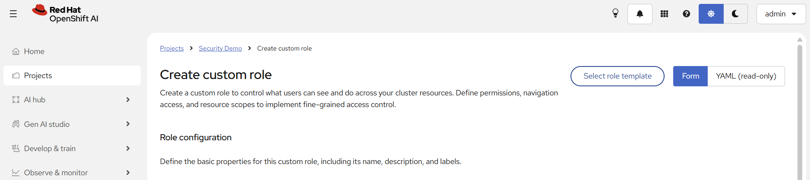
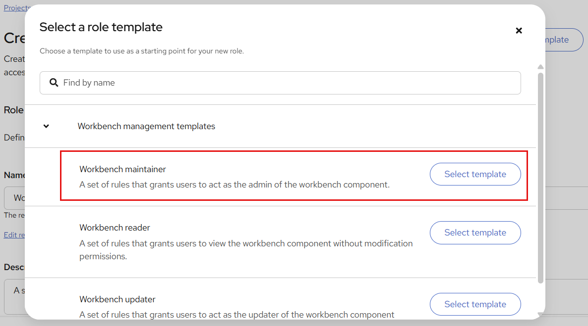
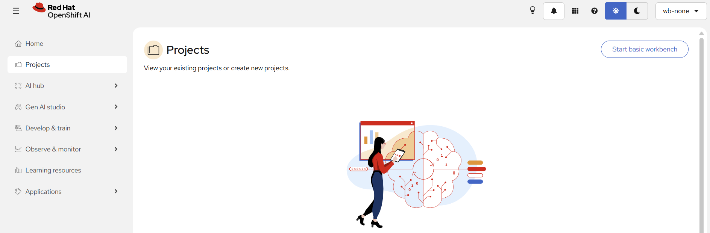
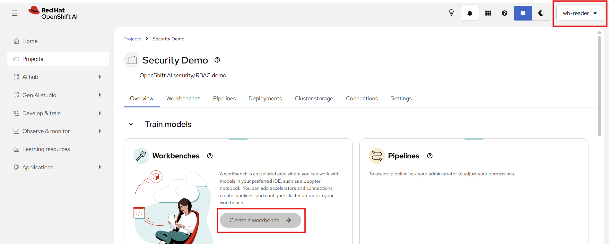
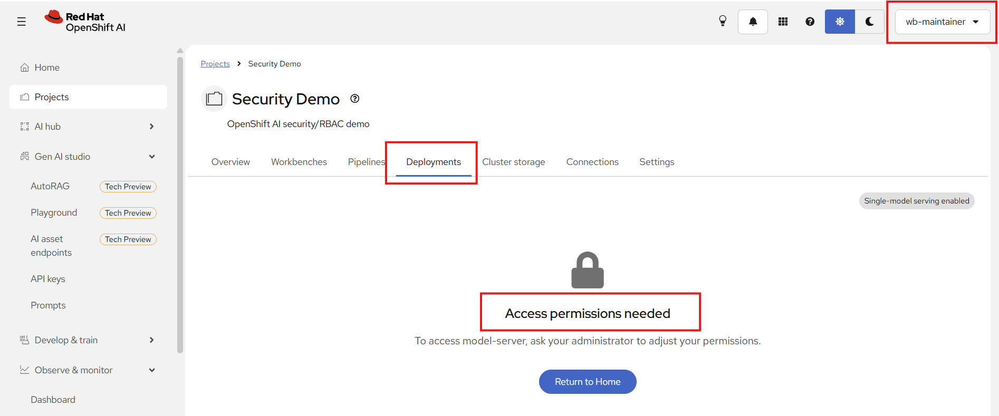

# 시나리오 1. 데이터 사이언스 프로젝트 커스텀 RBAC 역할 생성 UI

## 기능 설명

- 분류: API 및 운영 관리 > 보안/권한 (GA)
- 프로젝트 관리자는 CLI나 YAML 없이 Dashboard UI에서 프로젝트 범위의 커스텀 Role을 만든다.
- 관리자는 `Workbench maintainer` 같은 템플릿에서 시작하거나 기존 Role을 복제할 수 있으며, 생성 전에 YAML 프리뷰로 결과를 확인한다.
- 이전에는 기본 역할(Admin, Contributor) 외의 권한을 주려면 `oc create role` 또는 YAML을 직접 작성해야 했다.

## 사전 준비

1. 관리자는 데모 프로젝트를 만든다.

```
oc new-project security-demo --display-name="Security Demo"
oc label namespace security-demo opendatahub.io/dashboard=true
```

2. 관리자는 Dashboard 기능 플래그 `roleManagement`, `projectRBAC`가 `true`인지 확인한다.

```
oc get odhdashboardconfig odh-dashboard-config -n redhat-ods-applications -o jsonpath="{.spec.dashboardConfig.roleManagement} {.spec.dashboardConfig.projectRBAC}"
```

3. 관리자는 기능 제한을 보여 줄 일반 사용자 계정 3개를 identity provider에 등록한다. 비밀번호는 이 문서에 기록하지 않는다.

| 계정 | 부여할 역할 | 용도 |
|------|-------------|------|
| `admin` | 클러스터 관리자 | 역할 생성과 부여 |
| `wb-maintainer` | Workbench maintainer | 워크벤치만 관리하는 사용자 |
| `wb-reader` | Workbench reader | 조회만 하는 사용자 |
| `wb-none` | 없음 | 대조군 |

## 시연 절차

### 1) Project Settings → Roles 메뉴 이동

1. `admin`은 Dashboard의 **Projects** → `Security Demo` → **Settings** → **Roles**로 이동한다.
2. `admin`은 현재 프로젝트의 역할 목록을 보여 준다.



### 2) Role 생성 위저드 진입

1. `admin`은 **Create custom role** 화면에서 **Select role template**을 열고 `Workbench maintainer`를 선택한다.
2. `admin`은 **Role configuration**에 역할 이름 `workbench-maintainer-custom`을 입력한다.



| 템플릿 | 설명 |
|--------|------|
| Workbench maintainer | 워크벤치 컴포넌트의 관리자 역할 |
| Workbench reader | 수정 권한 없이 워크벤치를 조회하는 역할 |
| Workbench updater | 워크벤치 컴포넌트를 업데이트하는 역할 |

### 3) 폼 기반 권한 선택 → YAML 프리뷰 → 생성

1. `admin`은 **Form** 보기에서 템플릿이 채운 권한을 확인한다.
2. `admin`은 토글을 **YAML (read-only)** 로 바꿔 폼 선택이 `rules`로 변환된 결과를 보여 준다.
3. `admin`은 역할을 생성한다.
4. `admin`은 같은 방법으로 `Workbench reader` 템플릿에서 두 번째 역할을 생성한다.

### 4) 일반 사용자에게 역할 부여

`admin`은 프로젝트의 권한 화면에서 역할을 할당하거나, 다음 명령으로 RoleBinding을 만든다.

```
oc create rolebinding wb-maintainer-workbench-maintainer --role=workbench-maintainer --user=wb-maintainer -n security-demo
oc create rolebinding wb-reader-workbench-reader --role=workbench-reader --user=wb-reader -n security-demo
```

`wb-none`에는 역할을 부여하지 않는다.

### 5) 일반 사용자로 로그인해 기능 제한 확인

시연자는 브라우저 시크릿 창에서 각 계정으로 Dashboard에 로그인한다.

- `wb-none`: Projects 목록에 `Security Demo`가 보이지 않는다.



- `wb-reader`: 프로젝트와 워크벤치는 보이지만 **Create a workbench** 버튼이 비활성화되어 있다.



- `wb-maintainer`: 워크벤치는 만들 수 있지만 **Deployments** 탭은 **Access permissions needed**를 표시한다.



## 결과 확인

1. 관리자는 UI에서 만든 역할과 바인딩이 표준 Kubernetes 리소스인지 확인한다.

```
oc get role -n security-demo -l opendatahub.io/dashboard=true
oc get rolebinding -n security-demo -o wide
```

2. 관리자는 사용자별 권한을 API 서버에 질의한다.

```
oc auth can-i create notebooks.kubeflow.org -n security-demo --as=wb-reader
```

| 동작 | `wb-maintainer` | `wb-reader` | `wb-none` |
|------|:---:|:---:|:---:|
| 프로젝트 보기 | yes | yes | no |
| 워크벤치 조회 | yes | yes | no |
| 워크벤치 생성·삭제 | yes | no | no |
| Secret 읽기 | yes | no | no |
| 모델 배포 | no | no | no |
| 권한 부여(RoleBinding 생성) | no | no | no |

## Summary

- 프로젝트 관리자는 CLI나 YAML 없이 Dashboard 위저드와 템플릿으로 커스텀 Role을 생성했다.
- 생성된 Role은 표준 Kubernetes `Role`이며, Kubernetes RBAC가 사용자별 기능 제한을 강제했다.
- `wb-maintainer`는 워크벤치만 관리하고 모델 배포는 할 수 없었으며, `wb-reader`는 조회만 했고, 역할이 없는 `wb-none`은 프로젝트를 볼 수 없었다.

## 운영 가이드

- 프로젝트 관리자는 기본 역할로 부족한 세분화된 권한을 직접 설계할 수 있다.
- YAML을 모르는 사용자는 폼으로 작성하고, YAML을 아는 사용자는 프리뷰로 검증한다.
- 결과물은 표준 Kubernetes `Role`이므로 기존 감사·GitOps 체계와 호환된다.
- 실제 제한은 Kubernetes RBAC가 강제한다. 사용자가 `oc`로 직접 접근해도 결과는 같다.
- 자동화: `harness/harness.sh scenario1-prep | scenario1-bind | scenario1-verify | scenario1-stop` (Windows: `.\harness\harness.cmd <명령>`)
