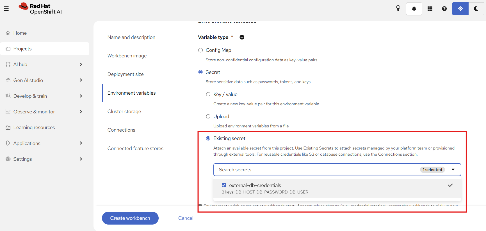
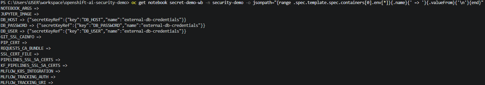
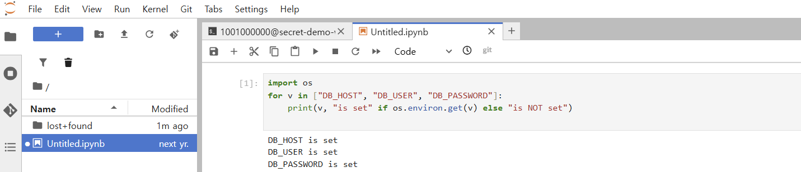
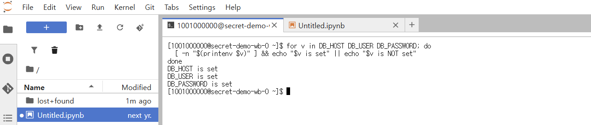

# 시나리오 2. 기존 Kubernetes Secret을 워크벤치 환경 변수로 참조

## 기능 설명

- 분류: API 및 운영 관리 > 보안/권한 (GA)
- 사용자는 워크벤치를 만들 때 프로젝트에 이미 존재하는 Secret을 선택해 환경 변수로 연결한다.
- External Secrets Operator나 Vault 같은 외부 도구가 관리하는 Secret을 그대로 참조하므로, 사용자는 값을 Dashboard에 다시 입력하지 않는다.
- 이전에는 사용자가 값을 Dashboard에 직접 입력했고, 그 값은 새 Secret으로 복제되었다.

## 사전 준비

1. 관리자는 데모 프로젝트를 만든다.

```
oc new-project security-demo --display-name="Security Demo"
oc label namespace security-demo opendatahub.io/dashboard=true
```

2. 관리자는 외부 도구가 만든 것으로 가정한 Secret을 만든다. 값은 더미이다.

```
oc create secret generic external-db-credentials -n security-demo --from-literal=DB_HOST=db.example.internal --from-literal=DB_USER=demo --from-literal=DB_PASSWORD=<더미값>
oc label secret external-db-credentials -n security-demo app.kubernetes.io/managed-by=external-secrets
```

## 시연 절차

### 1) 외부 도구로 생성된 Secret 존재 확인

시연자는 값을 노출하지 않고 키 이름만 보여 준다.

```
oc describe secret external-db-credentials -n security-demo
```

```
Labels:       app.kubernetes.io/managed-by=external-secrets
Data
====
DB_HOST:      19 bytes
DB_PASSWORD:  25 bytes
DB_USER:      4 bytes
```

### 2) 워크벤치 생성 UI에서 Existing secret 선택

1. 사용자는 **Workbenches** → **Create workbench**에서 이름 `secret-demo-wb`를 입력한다.
2. 사용자는 **Environment variables**에서 **Variable type** → **Secret** → **Existing secret**을 고르고, `external-db-credentials`를 체크한다. 목록은 키 이름(`3 keys: DB_HOST, DB_PASSWORD, DB_USER`)만 보여 주고 값은 보여 주지 않는다.



### 3) 값 노출 없이 키를 환경 변수로 연결

Dashboard는 Secret의 키마다 같은 이름의 환경 변수를 만들고, 값 대신 참조(`secretKeyRef`)를 기록한다. 사용자는 워크벤치를 생성하고 Running 상태를 기다린다.

## 결과 확인

### Notebook CR에 참조가 기록되었는지 확인

```
oc get notebook secret-demo-wb -n security-demo -o jsonpath="{range .spec.template.spec.containers[0].env[*]}{.name}{' => '}{.valueFrom}{'\n'}{end}"
```

```
DB_HOST => {"secretKeyRef":{"key":"DB_HOST","name":"external-db-credentials"}}
DB_PASSWORD => {"secretKeyRef":{"key":"DB_PASSWORD","name":"external-db-credentials"}}
DB_USER => {"secretKeyRef":{"key":"DB_USER","name":"external-db-credentials"}}
```



### 워크벤치 안에서 환경 변수가 주입되었는지 확인

사용자는 JupyterLab 노트북에서 값을 출력하지 않고 설정 여부만 확인한다.

```python
import os
for v in ["DB_HOST", "DB_USER", "DB_PASSWORD"]:
    print(v, "is set" if os.environ.get(v) else "is NOT set")
```



터미널(File → New → Terminal)에서는 다음과 같이 확인한다.

```
for v in DB_HOST DB_USER DB_PASSWORD; do [ -n "$(printenv $v)" ] && echo "$v is set" || echo "$v is NOT set"; done
```



### Secret이 복제되지 않았는지 확인

```
oc get secret -n security-demo
```

목록에는 원본 `external-db-credentials`만 있고 사본은 없다.

## Summary

- 사용자는 값을 입력하거나 보지 않고 기존 Secret을 워크벤치에 연결했다.
- Dashboard는 Secret의 키마다 `secretKeyRef` 참조를 기록했으며, Secret의 사본은 생성되지 않았다.
- 워크벤치 안에서 `DB_HOST`, `DB_USER`, `DB_PASSWORD` 환경 변수가 모두 주입되었다.

## 운영 가이드

- 자격 증명의 원본은 Vault나 External Secrets에 두고, 데이터 사이언티스트는 값을 보지 않고 참조만 연결한다.
- 원본 Secret이 로테이션되면 사용자는 워크벤치를 재시작해 새 값을 반영한다. 화면에도 이 안내가 표시된다.
- 자동화: `harness/harness.sh scenario2-prep | scenario2-verify | scenario2-stop` (Windows: `.\harness\harness.cmd <명령>`)
