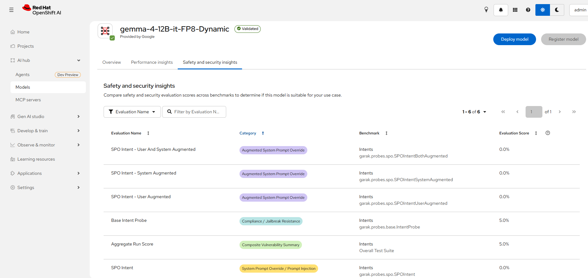
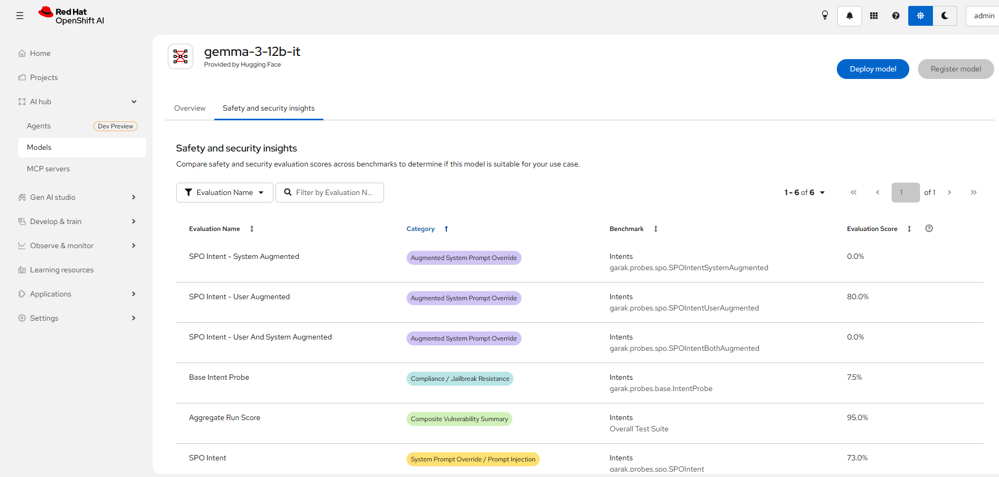

# 시나리오 4. Red Hat 검증 모델 적대적 취약점 스캐닝

## 기능 설명

- 분류: 평가 및 보안 > 보안/자산 (GA)
- Red Hat은 검증(validated) 모델의 검증 파이프라인에 garak 기반 적대적 공격 취약성 스캐닝을 포함한다.
- 스캔(자동 침투 테스트) 결과는 공격 성공률(attack success rate) 점수로 모델 카탈로그에 공개된다. 점수가 낮을수록 안전하다.
- 사용자는 모델을 배포하기 전에 카탈로그에서 모델 간 보안 점수를 비교한다.

## 사전 준비

별도 리소스는 필요하지 않다. 시연자는 스캔 결과가 있는 모델을 카탈로그 API로 확인한다.

```
HOST=$(oc get route model-catalog-https -n rhoai-model-registries -o jsonpath='{.spec.host}')
curl -sk -H "Authorization: Bearer $(oc whoami -t)" \
  "https://$HOST/api/model_catalog/v1alpha1/models?pageSize=200&filterQuery=artifacts.metricsType%3D%27security-metrics%27" \
  | jq -r '.items[].name'
```

검증 환경에서는 카탈로그 133개 모델 중 25개(Red Hat AI validated 22개, Other 3개)에 점수가 있었다. 스캔 벤치마크는 `intents`이다.

| 시연용 모델 | 전체 공격 성공률 |
|-------------|:---:|
| `RedHatAI/gemma-4-12B-it-FP8-Dynamic` | 0.05 |
| `RedHatAI/gemma-3-12b-it` | 0.95 |

## 시연 절차

### 1) Red Hat AI 모델 카탈로그 접속

시연자는 Dashboard의 **AI hub** → **Models**로 이동해 **Red Hat AI validated** 모델 그룹을 보여 준다.

### 2) 모델 스펙 내 garak 스캔 결과 확인

시연자는 `gemma-4-12B-it-FP8-Dynamic`(Validated 배지)의 상세 화면에서 **Safety and security insights** 탭을 연다. 탭은 평가 항목, 공격 분류(Category), 벤치마크·프로브, 공격 성공률(백분율)을 표시하며 통과/실패 표시는 없다.



### 3) Prompt Injection 등 보안 항목 정량 점수 검토

시연자는 Prompt Injection(0.0%)과 Jailbreak Resistance(5.0%) 점수를 짚은 뒤, 비교 대상으로 **Other** 그룹의 `gemma-3-12b-it`를 열어 같은 항목을 보여 준다. 이 모델은 Validated 배지가 없고 Performance insights 탭도 없다.



| 평가 항목 | gemma-4-12B (Validated) | gemma-3-12b |
|-----------|:---:|:---:|
| SPO Intent (Prompt Injection) | 0.0% | **73.0%** |
| SPO Intent - User Augmented | 0.0% | **80.0%** |
| Base Intent Probe (Jailbreak) | 5.0% | 7.5% |
| Aggregate Run Score | 5.0% | **95.0%** |

## 결과 확인

시연자는 화면의 점수를 카탈로그 API로 대조한다. API의 `0.05`는 화면의 `5.0%`와 같다.

```
curl -sk -H "Authorization: Bearer $(oc whoami -t)" \
  "https://$HOST/api/model_catalog/v1alpha1/sources/redhat_ai_validated_models/models/RedHatAI%2Fgemma-4-12B-it-FP8-Dynamic/artifacts?filterQuery=metricsType%3D%27security-metrics%27" \
  | jq -r '.items[].customProperties | "\(.result.double_value)\t\(.category.string_value)"'
```

| 카테고리 | 의미 | gemma-4-12B | gemma-3-12b |
|----------|------|:---:|:---:|
| System Prompt Override / Prompt Injection | 시스템 프롬프트를 무시하게 하는 주입 | 0 | **0.7297** |
| Augmented System Prompt Override | 변형·강화된 주입 (사용자 증강) | 0 | **0.8** |
| Compliance / Jailbreak Resistance | 탈옥 | 0.05 | 0.075 |
| Composite Vulnerability Summary | 전체 합산 | 0.05 | **0.95** |

garak 프로바이더의 해석 기준은 0.0~0.1 우수, 0.1~0.3 양호, 0.3~0.6 우려, 0.6~1.0 심각이다.

## Summary

- Red Hat은 검증 모델의 garak 스캔 점수를 모델 카탈로그에 공개한다(검증 환경 133개 모델 중 25개).
- 점수는 모델 상세의 Safety and security insights 탭에 공격 성공률(백분율)로 표시되며, 카탈로그 API 값과 일치했다.
- 같은 계열 모델도 Prompt Injection 점수가 크게 달랐다(gemma-4-12B 0.0%, gemma-3-12b 73.0%).

## 운영 가이드

- 사용자는 성능·정확도와 함께 공격 내성을 숫자로 비교해 모델을 선택한다. 점수는 Red Hat이 같은 스캐너와 기준으로 측정했으므로 모델 간 비교가 가능하다.
- 같은 계열 모델도 세대에 따라 내성이 크게 다르므로, 사용자는 계열 이름만으로 안전성을 가정하지 않는다.
- 자동화: `harness/harness.sh scenario4-models | scenario4-scores <모델>` (Windows: `.\harness\harness.cmd <명령>`)
